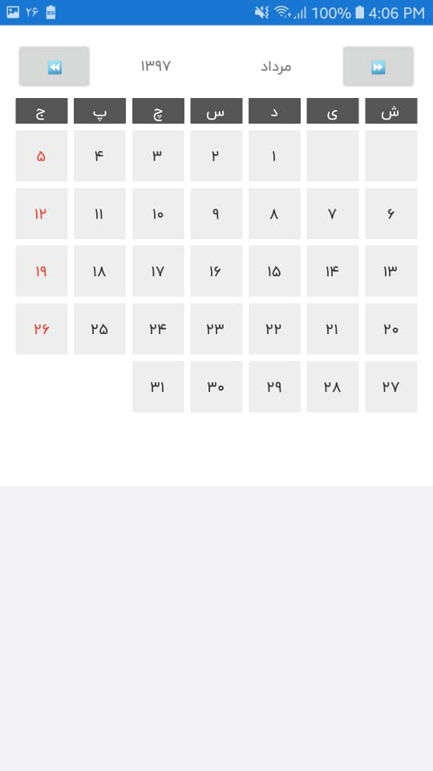

# XamarinFormsPersianCalendar
Xamarin Forms Persian Calendar
By <a href="http://hosseinbadrnezhad.ir">Hossein Badrnezhad</a>

how to Install :
---
1 - Add `PCCalendar.cs` and `PCLabel.cs` as Custom Control.

2 - Add all classes in `Helper Class`.

3 - Add `CustomLabelRender` in `Android` and `iOs`.

how to use :
---
1 - Add 'xmlns:local="clr-namespace:PC.PersianCalendar"' in Content Page.

2 - Add this code in your page :

<local:PCCalendar BackgroundColor="#FFF" HeaderBackgroundColor="#F8F8F8" HeaderTextColor="#333" />
